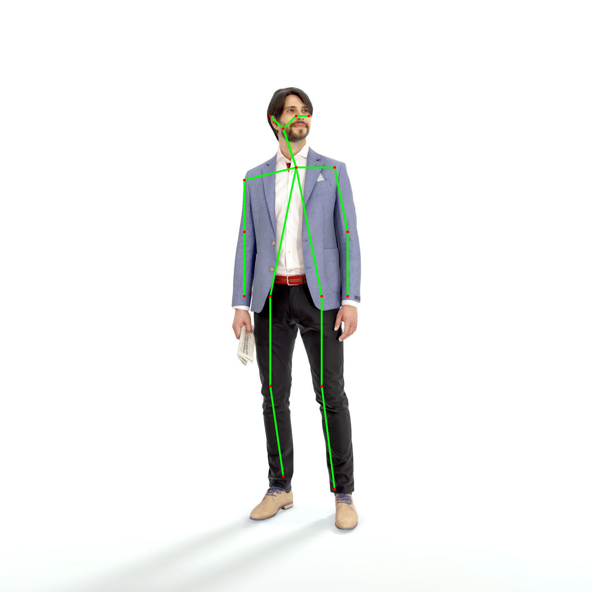

# **Human Pose Estimation using Machine Learning**  

  

## **🔍 Overview**  
This project detects **human poses** in images and videos using **machine learning** and provides a **Streamlit-based web interface** for an interactive experience. The model identifies key body parts and maps them to analyze human posture and movements.

---

## **🚀 Features**  
✅ **Streamlit Web App** – Run pose estimation via a web-based UI  
✅ **Real-time Pose Detection** – Analyze live webcam feed  
✅ **Image & Video Processing** – Detect poses in static images and pre-recorded videos  
✅ **Pre-trained Model** – Uses TensorFlow for accurate pose estimation  

---

## **🛠️ Installation**  

### **1️⃣ Clone the Repository**  
```bash
git clone https://github.com/YeshitaMotwani/Human-Pose-Estimation.git
cd Human-Pose-Estimation
```

### **2️⃣ Set Up a Virtual Environment (Recommended)**
```bash
python -m venv venv
source venv/bin/activate  # Windows: venv\Scripts\activate
```

### **3️⃣ Install Dependencies**  
```bash
pip install -r requirements.txt
```

---

## **💻 Running the Streamlit Web App**  

### **Run the App**
```bash
streamlit run estimation_app.py
```
📌 **This will open the web interface in your default browser.**  

### **Using the Web UI:**  
1. **Upload an Image/Video** to detect human poses.  
2. **Choose Webcam Mode** for real-time pose estimation.  
3. View **detection results instantly** in your browser!  

---

## **🖼️ Pose Estimation on Images**  
To process an image **without Streamlit**, run:  
```bash
python pose_estimation.py --image_path path/to/your/image.jpg
```
📌 Replace `path/to/your/image.jpg` with the actual image file path.  

---

## **📹 Pose Estimation on Videos**  
For processing a **video file**, use:  
```bash
python pose_estimation_Video.py --video_path path/to/your/video.mp4
```
📌 Replace `path/to/your/video.mp4` with the actual video file path.  

---

## **📡 Real-Time Pose Estimation (Webcam Mode)**  
Run the script to analyze live webcam feed:  
```bash
python estimation_app.py
```
📌 Ensure your **webcam is connected** and properly configured.  

---

## **📂 Output Files**  
🔹 **Processed Images** → Saved in the `output/` folder  
🔹 **Processed Videos** → Saved in the `output/` folder  

---

## **📜 Model & Data**  
- The project uses a **pre-trained pose estimation model** (`graph_opt.pb`) for detecting human body keypoints.  
- The model is optimized for **real-time inference** and works efficiently on **CPU & GPU**.  

---

## **📦 Dependencies**  
The project requires the following Python libraries:  
- **Streamlit** (for the web UI)  
- **OpenCV** (for image processing)  
- **TensorFlow** (for pose detection)  
- **NumPy** (for array computations)  

📌 All dependencies are listed in `requirements.txt`. Install them with:  
```bash
pip install -r requirements.txt
```

---

## **🤝 Contributing**  
Contributions are welcome! To contribute:  
1. Fork the repository.  
2. Create a new branch (`git checkout -b feature-branch`).  
3. Commit your changes (`git commit -m "Added new feature"`).  
4. Push to your fork and submit a Pull Request.  

---

## **📜 License**  
This project is licensed under the **MIT License**. See `LICENSE` for details.  

---

## **🙌 Acknowledgements**  
Special thanks to the **open-source community** and the developers of TensorFlow, OpenCV, and Streamlit for making this project possible.  

---

### **✨ Now your GitHub README will look professional and informative!** 🚀  
Would you like me to add any images, GIFs, or badges to make it even better? 😊
